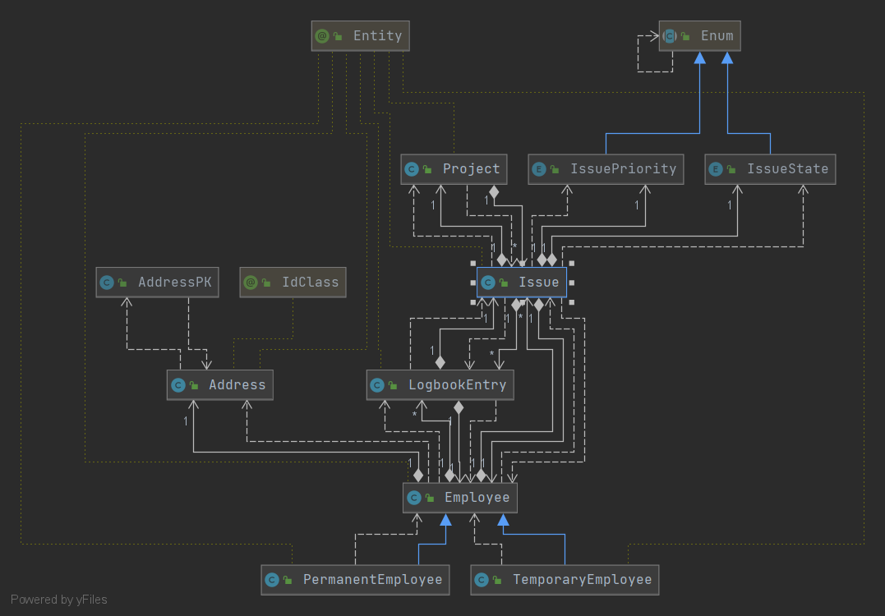
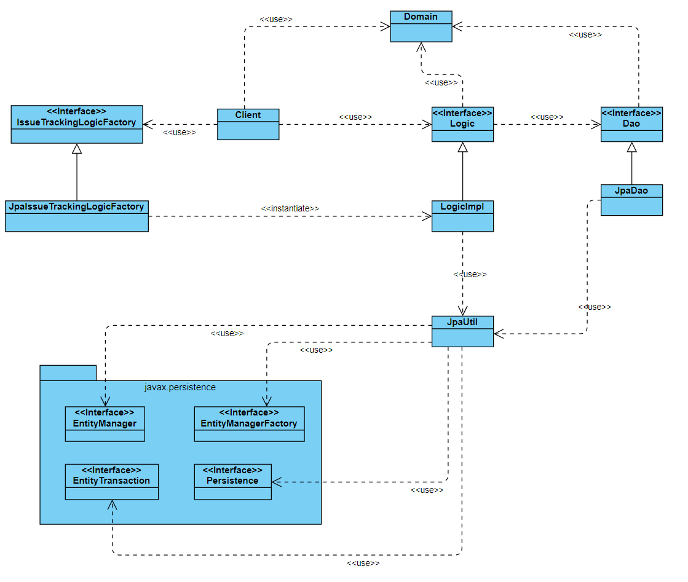

# Issue tracking with JPA/Hibernate

2021-03-15

Michael Dumfart, S1810307059

Effort: 26h

## Commands
Start docker container:
```docker-compose up -d```

Run tests:
```mvn test```

Run console application:
```mvn exec:java -pl issue-tracking-orm```

## UML Diagram Domain Classes


## UML Diagram: Dependencies to javax.persistence

